# Prototipo de Baixa Fidelidade

## Introducao

O prototipo de baixa fidelidade apresenta a estrutura atual do Portal AAC depois da implementacao realizada no projeto. O objetivo e representar as telas principais de forma simples, sem detalhamento visual de alta fidelidade, para documentar fluxo, hierarquia de informacao e acoes esperadas.

Esta versao acompanha o que existe hoje na aplicacao React e na API Django REST:

- login com mensagem de erro;
- cadastro publico de aluno;
- recuperacao de senha antes do login;
- dashboard do aluno;
- solicitacoes internas e externas;
- historico de atividades;
- perfil e troca de senha;
- painel administrativo para funcionarios;
- documentacao da API com Swagger/Redoc.

## Metodologia

Os prototipos foram atualizados a partir das rotas e componentes implementados no frontend:

- `/login`
- `/cadastro`
- `/home`
- `/solicitacoes`
- `/perfil`
- `/admin`

Tambem foram considerados os principais endpoints do backend, como login, cadastro, recuperacao de senha, criacao de solicitacoes, validacao administrativa, categorias, eventos e schema OpenAPI.

Os desenhos abaixo seguem o estilo de baixa fidelidade usando PlantUML Salt, com foco em blocos, campos, botoes e fluxo.

## Versao 2.0 - Prototipo Atualizado

### Tela 1: Login

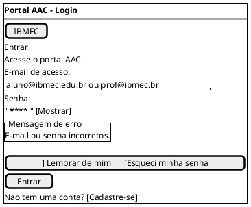

### Tela 2: Recuperar Senha Antes do Login

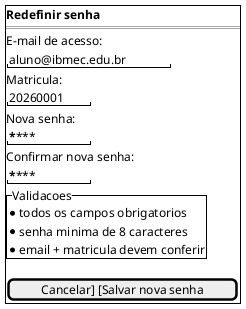

### Tela 3: Cadastro de Aluno

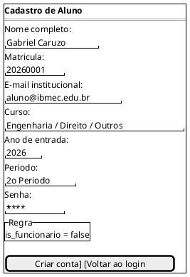

### Tela 4: Home / Dashboard do Aluno

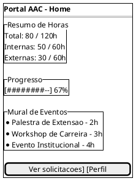

### Tela 5: Solicitacoes - Escolha do Fluxo

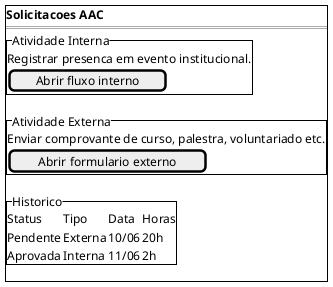

### Tela 6: Atividade Interna

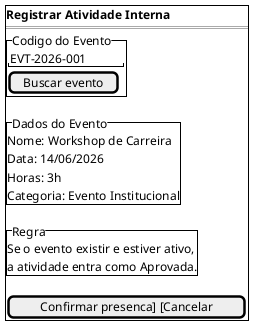

### Tela 7: Atividade Externa

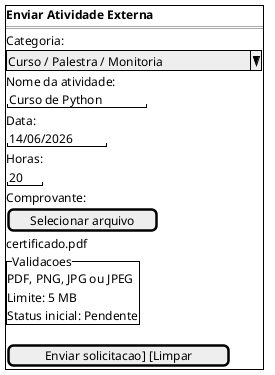

### Tela 8: Historico de Solicitacoes

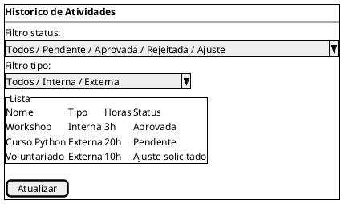

### Tela 9: Perfil do Usuario

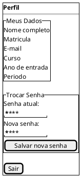

### Tela 10: Painel Administrativo

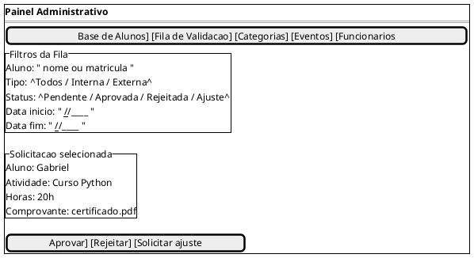

### Tela 11: Administracao de Categorias e Eventos

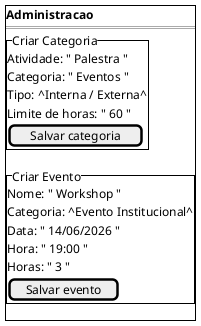

### Tela 12: Documentacao da API

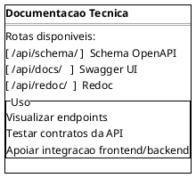

## Fluxo Geral Atual

```plantuml
@startsalt
{+
Login
  |
  +-- Cadastro de aluno
  |
  +-- Recuperar senha
  |
  +-- Aluno autenticado
  |      |
  |      +-- Home / Dashboard
  |      +-- Solicitacoes
  |      |      +-- Atividade interna
  |      |      +-- Atividade externa
  |      |      +-- Historico
  |      +-- Perfil
  |
  +-- Funcionario autenticado
         |
         +-- Painel administrativo
         +-- Validar solicitacoes
         +-- Gerenciar categorias
         +-- Gerenciar eventos
         +-- Cadastrar funcionarios
}
@endsalt
```

## Conclusao

O prototipo atualizado representa a aplicacao implementada atualmente. A nova versao deixa explicito que o sistema possui duas jornadas principais: a jornada do aluno, focada no envio e acompanhamento de atividades, e a jornada do funcionario, focada na validacao e administracao do processo.

## Autor(es)

| Data | Versao | Descricao | Autor(es) |
| --- | --- | --- | --- |
| 07/04/26 | 1.0 | Criacao do documento inicial | Gabriel Caruzo |
| 14/06/26 | 2.0 | Atualizacao conforme implementacao atual do Portal AAC | Gabriel Caruzo |
